This is a command line utility to create meeting notes from your Google Calendar

**Note**: Currently, this utility has the following functionality:

1. **Generates** a _meeting notes_ document from your current meeting, if one is occuring, or your next meeting on your Google calendar
2. **Create** a _markdown formatted file_ on you local machine OR a _Google Document_

Usage
=====

```bash
usage: m [-h] [-g | -m]

a cli application to create a meeting notes Google Doc or local markdown file for a current or an impending meeting on your Google Calendar

optional arguments:
  
    -h, --help      show this help message and exit
    -g, --google    create a new google doc with minutes
    -m, --markdown  create a local markdown file with minutes

```

Installation
============

To install, simply run the following command in your terminal:

```bash
$ pip install --upgrade meet
```
and then

## Setup your Google OAuth 2.0 client ID

1. **Navigate** to [https://console.developers.google.com/apis/library](https://console.developers.google.com/apis/library)
2. **Click** on the _Select a project_ dropdown menu:

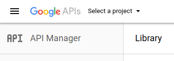

3. **Click** the _plus button_ on the top right of the modal dialog box:

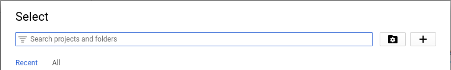

4. **Enter** a _Project name_ and then **click** the _Create_ button:

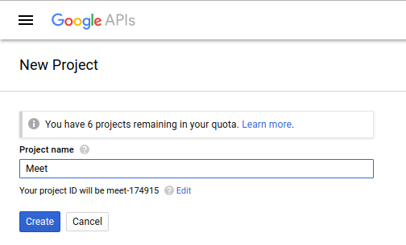

5. **Wait** until Google creates your project.  Upon completion, you will see a _notification icon_ at the top right of the page:


6. **Click** on the _Select a project_ drop down:  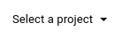

7. **Click** on the _name_ of the project created in step 4:

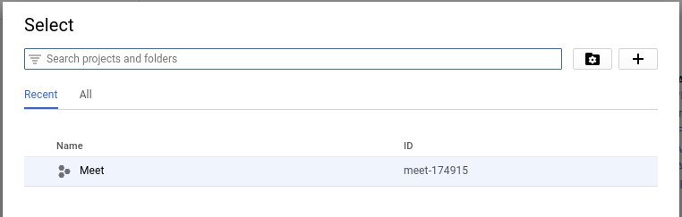

8. For both the Drive API and the Calendar API, perform the following steps:
    
    a. **Click** on the _api_ link:

    

    b. **Click** the _enable_ button to enable the API for the project: 

9. **Click** on the _Credentials_ left navigation menu item and then **click** on the _OAuth consent screen_ tab:

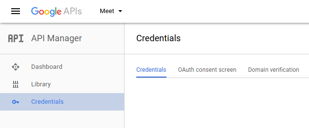

10. **Enter** a _Product name shown to users_ and then **click** on the _Save_ button:

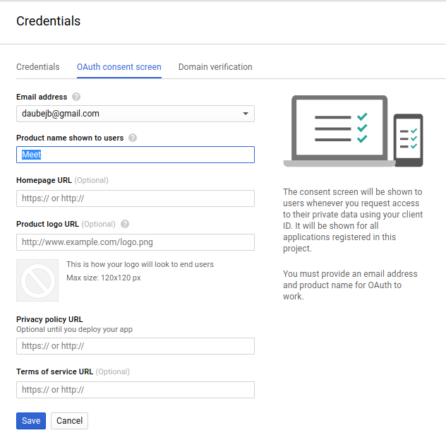

11. **Click** on the _Create credentials_ drop down menu and then **click** _OAuth client ID_:

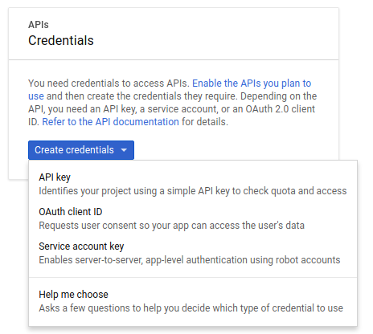

12. **Select** the _Other_ radio button and then **click** the _Create_ button:

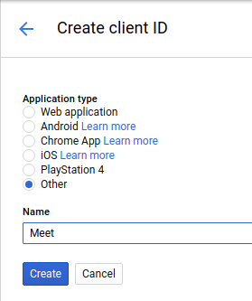

13. **Click** on the _Download Icon_ at the right side of the table for the OAuth 2.0 client ID that was created in step 12:

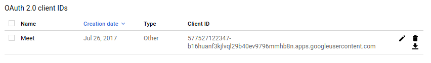

14. **Save** the _client_secret.json_ file to your computer

15. **Rename** the long file name to _meet_client_secret.json_

```
Note: if you want to name the file something else, make sure to update the configuration in the meet_config.ini file located at: ~/.config/meet_config.ini
```

16. **Move** the file to the following directory:  ~/.config/meet_client_secret.json

```
Note: if you want to store your client secret file somewhere else, make sure to update the location in the meet_config.ini file, depicted below:
```

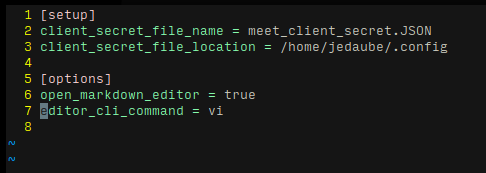


Supported Python Version
========================

Supports Python 3.5
